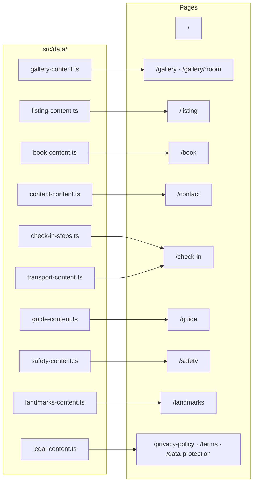

# Nomad's Nest

Website for [Nomad's Nest](https://nomadsnest.live), a self-catering rental apartment in Ayia Napa, Cyprus. Migrated from Squarespace to a self-hosted Next.js site on Vercel.

## Stack

- **Next.js 16** (App Router, TypeScript, Turbopack)
- **Tailwind CSS v4**: design tokens via `@theme inline` in `globals.css`, no `tailwind.config.ts`
- **shadcn/ui**: `button`, `tabs`, and `dialog` components
- **Framer Motion**: scroll fade-in animations via `FadeIn` wrapper
- **Bun**: package manager and runtime
- **Vercel Analytics**: cookieless page-view analytics

## Development

```bash
bun install
bun run dev      # http://localhost:3000
bun run build    # production build (run before committing)
bun run lint
```

## Site structure

All page content is typed TypeScript constants in `src/data/` — no CMS, no API calls. Images live in `public/images/`; `gallery/` is the canonical source shared by the gallery, listing, safety, and landmarks pages. The home page hero references gallery images directly.



## docs/

| File | Purpose | Kind |
|------|---------|------|
| `blueprint.md` | Single source of truth for design system, architecture, and all phases | Living |
| `image-management.md` | Step-by-step guide for adding, replacing, reordering, and removing images | Living |
| `transport-routes.md` | Authoritative research behind the bus route data in `transport-content.ts` | Living |
| `alt-text-annotations.txt` | Alt text inventory for all images (applied to code; kept as reference archive) | Reference |
| `nomadsnest-design-spec.md` | Original design system spec from the initial build | Historical |
| `nomadsnest-rebuild-spec.md` | Original Squarespace migration spec from March 2026 | Historical |
| `prompt.txt` | Original creative brief that informed the blueprint | Historical |

## scripts/

| File | Purpose |
|------|---------|
| `compress-images.sh` | Batch-compress JPEGs to under 500 KB using macOS `sips` |
| `fill-logo-transparency.py` | Fill transparent PNG backgrounds (one-time utility) |

## Deployment

Hosted on Vercel Hobby (free). Pushes to `main` deploy automatically. Domain: `nomadsnest.live`.

## License

MIT. See [LICENSE](LICENSE).
